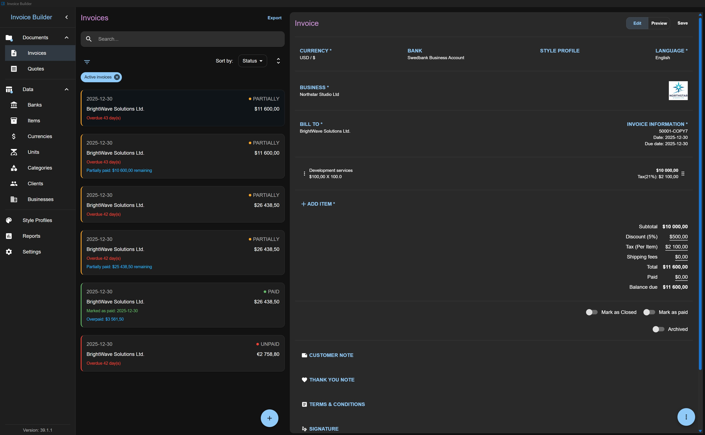
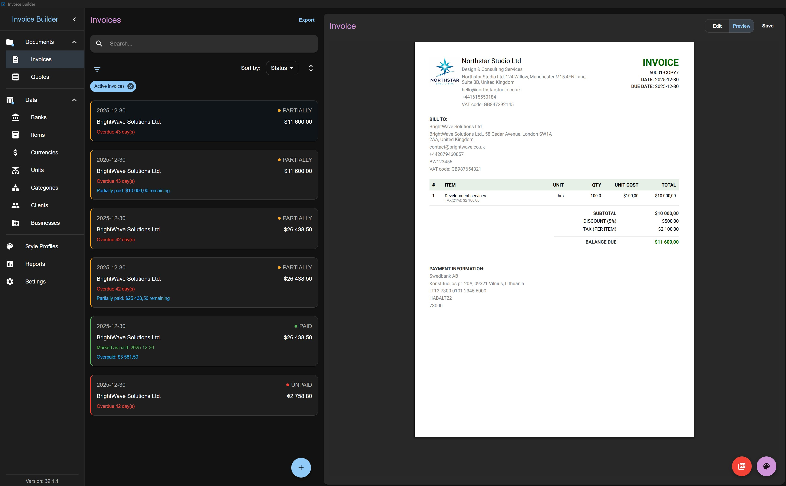
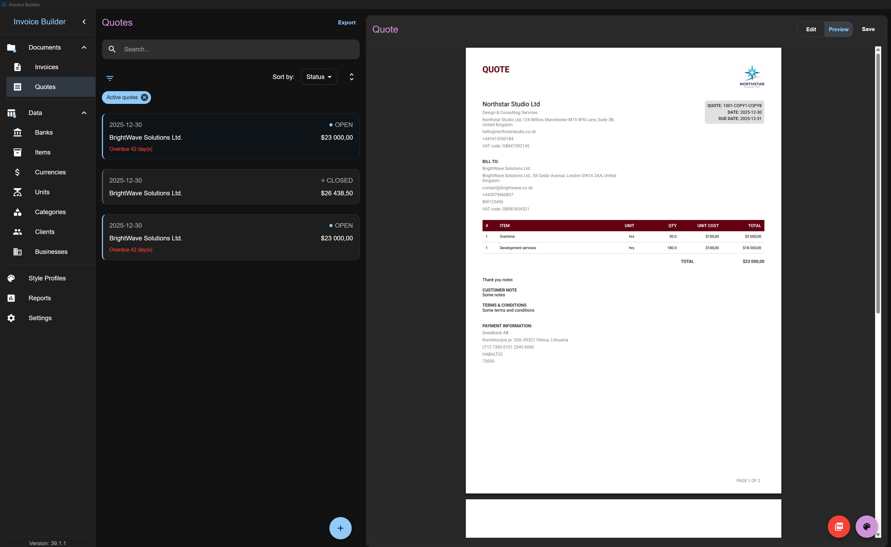

# Invoice Builder

[](https://piratuks.github.io/invoice-builder/)
[](LICENSE)
[](https://github.com/piratuks/invoice-builder/releases)
[](https://github.com/piratuks/invoice-builder/releases)


[](https://github.com/piratuks/invoice-builder/pkgs/container/invoice-builder)
[](https://github.com/sponsors/piratuks)
[](https://www.buymeacoffee.com/evaldizi)

<!-- markdownlint-disable MD033 -->

<a href="https://trendshift.io/repositories/17939?utm_source=repository-badge&amp;utm_medium=badge&amp;utm_campaign=badge-repository-17939" target="_blank" rel="noopener noreferrer"></a>
<a href="https://trendshift.io/repositories/17939?utm_source=trendshift-badge&amp;utm_medium=badge&amp;utm_campaign=badge-trendshift-17939" target="_blank" rel="noopener noreferrer"></a>
<!-- markdownlint-enable MD033 -->

Invoice Builder is an **offline-first, open-source invoicing and quoting application** for freelancers and small businesses. No accounts, no cloud, no subscriptions — your data stays on your machine in a database file you own, with an optional self-hosted web/Docker mode for multi-device access.

> **⚠️ One-time upgrade notice for version 3.0.2**
> Before upgrading, back up each existing database and make sure it completed migrations through version 2.10.0. Version 3.0.2 initializes new databases from a consolidated schema and does not include the historical migration chain, so databases with incomplete migrations are not upgraded. This applies to Electron, manual, and web/Docker upgrades.





## What it does

- Create and manage **Invoices** and **Quotes** with live PDF preview, A4/Letter formats, and a drag-and-drop Visual Layout Builder
- Manage Businesses, Clients, Banks, Items, Categories, Units, and Currencies, each with XLSX import/export
- Flexible financials: surcharges, discounts, shipping, inclusive/exclusive tax, partial payments, and document states
- Export invoices as UBL 2.1 / Peppol BIS Billing 3.0 or XRechnung XML for compliant e-invoicing
- Native receipt printing (desktop) and browser print-to-PDF receipts (web/Docker)
- Full database backup/restore, JSON export/import, and per-document data snapshots for historical accuracy
- Runs as a desktop app (Windows, Linux, macOS) backed by SQLite, or self-hosted via Docker with SQLite or PostgreSQL

## Quick start

**Desktop:** download the latest build for your platform from [Releases](https://github.com/piratuks/invoice-builder/releases).

**Docker:**

```bash
docker compose pull
docker compose up -d
```

Then open the frontend container's port in your browser and create or connect a database. See [Quick Start](https://piratuks.github.io/invoice-builder/docs/installation/quick-start/) and [Self-Hosting (Docker)](https://piratuks.github.io/invoice-builder/docs/installation/docker/) for details.

## Documentation

Full documentation is published at [piratuks.github.io/invoice-builder](https://piratuks.github.io/invoice-builder/):

- [Installation](https://piratuks.github.io/invoice-builder/docs/installation/): requirements, desktop install, Docker self-hosting, quick start
- [Guides](https://piratuks.github.io/invoice-builder/docs/guides/): screen-by-screen walkthrough, from database creation to layouts and e-invoices
- [Development](https://piratuks.github.io/invoice-builder/docs/development/): running locally, project structure, core stack, database schema

## Questions and ideas

Bugs and feature requests go in [Issues](https://github.com/piratuks/invoice-builder/issues). Questions and general discussion go in [Discussions](https://github.com/piratuks/invoice-builder/discussions).

## Development

Invoice Builder is an Electron + React app with an optional Node.js webserver, using SQLite or PostgreSQL for storage. See [Running Locally](https://piratuks.github.io/invoice-builder/docs/development/running-locally/) to set up a dev environment, and [CONTRIBUTING.md](CONTRIBUTING.md) before opening a PR.

## License

Invoice Builder is licensed under the [MIT License](LICENSE).

## Support

Invoice Builder is maintained by a single developer. If it saves you time, you can support its development through [GitHub Sponsors](https://github.com/sponsors/piratuks) or [Buy Me a Coffee](https://www.buymeacoffee.com/evaldizi).
